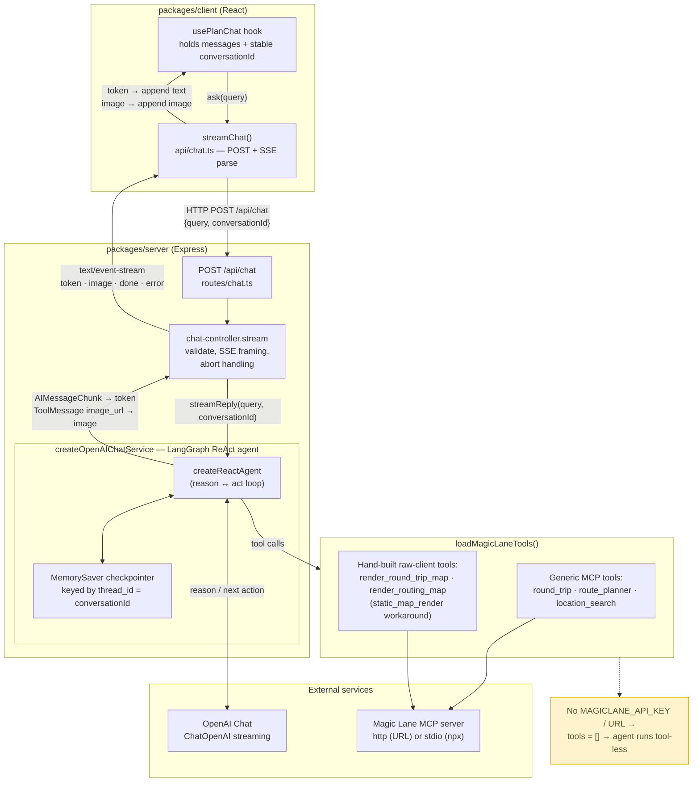
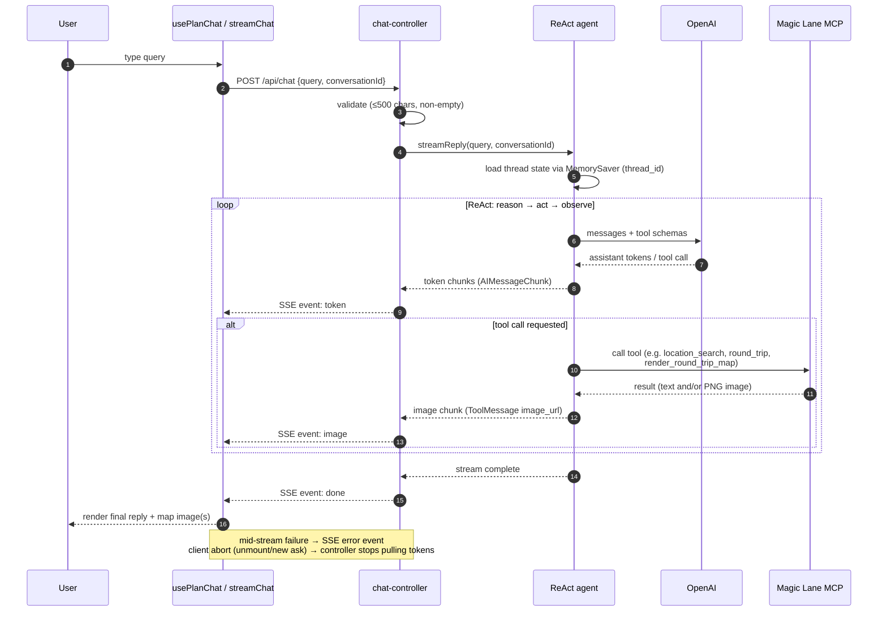

# ReAct Agent Flow

How a chat turn travels from the browser through the LangGraph ReAct agent and
back. Source of truth:

- Client: `packages/client/src/hooks/use-plan-chat.ts`, `src/api/chat.ts`
- Server HTTP/SSE: `packages/server/src/routes/chat.ts`, `controllers/chat-controller.ts`
- Agent: `packages/server/src/clients/openai-chat-client.ts`
- Tools: `packages/server/src/clients/magiclane-mcp-client.ts`
- Wire contract: `packages/shared/src/index.ts` (`ChatRequest`, `ChatStreamEvent`)

## Component view

## Turn sequence (the ReAct loop)

## Key behaviors

- **Memory threading** — `conversationId` is minted once per chat in the hook
  and sent on every turn; the server uses it as the LangGraph `thread_id` so
  follow-ups ("now add a stop in X") build on the route already planned.
- **Two chunk types stream back** — text `token`s from the model, and `image`s
  from tool results (rendered map PNGs arrive as `image_url` data-URL blocks).
- **Tool-less fallback** — with no Magic Lane config, `loadMagicLaneTools`
  returns `[]` and the agent still answers (text only); keeps dev/test running.
- **MCP transport is config-driven** — `MAGICLANE_MCP_URL` → HTTP to a running
  service; otherwise spawn `@magiclane/mcp-server` over stdio via `npx`.
- **`static_map_render` workaround** — its union input schema breaks client-side
  validation in `@langchain/mcp-adapters`, so the two render tools are
  hand-built against the raw MCP client with narrow Zod schemas.
